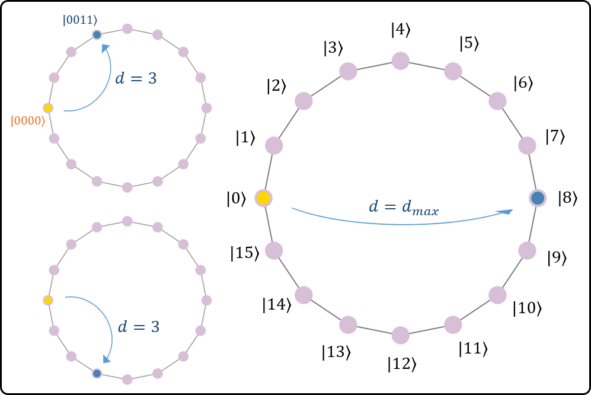
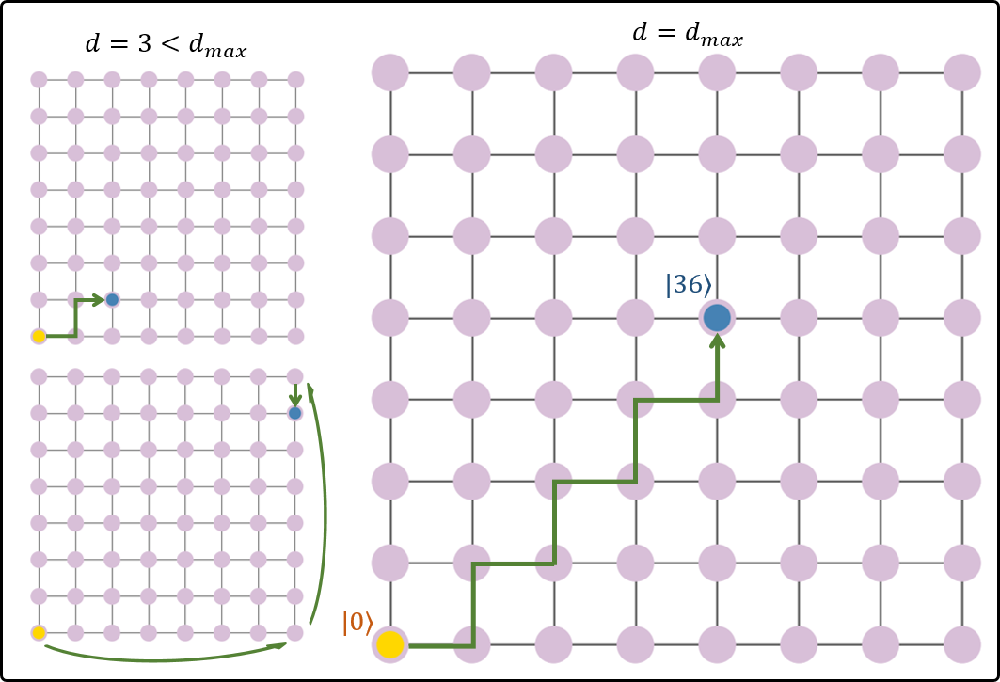

# Quantum WalkScore (QWS) Benchmark
This folder includes QWS-specific scripts.

Reference paper : (coming soon)

## The Graph Nodefinding problem
Let $G = (V,E)$ be an undirected graph where $V=\{v_0, v_1, \ldots, v_m\}$ is the set of vertices/nodes and $E$ the set of edges.
The graph nodefinding problem consists in finding a target node $v_t$ by moving a walker along edges of the graph from the source node $v_0$.

For benchmarking purposes, we consider two graph structures: cycle graphs and 2D-torus graphs.




Let $d$ be the distance between the source and target nodes.
The criteria for a successful benchmark test on a given instance $(n,d)$, described by the number of nodes $(2^n)$ and the distance $d$, is:

*"Finding the target node, located at a distance $d$ from the source node in the graph, with a success probability $p\geq p^*(n,d)$."*


## Metrics definition and Score evaluation
The metric is given by the mean success probability from all experiments conducted based on the protocol's input parameter requirements.

The overall scores $\text{QWS}_\text{cycle}$ and $\text{QWS}_\text{torus}$ quantify the largest problem size until which the success criteria has been met without failure.
Let $(n_\text{max}, d_\text{max})$ be the corresponding problem size.
The QWS score is given by

```math
\text{QWS}_\text{cycle} = 2^{n_\text{max}-1} + d_\text{max}
```
```math
\text{QWS}_\text{torus} = 2^{n_\text{max}} + d_\text{max}
```

## Code structure
Some files are required for all benchmarks so that these benchmarks can be successfully evaluated and experiments successfully conducted.
- `__init__.py`: defines benchmark-specific protocol parameters (here QWS) based on the benchmark-agnostic parameter class.
- `evaluate.py`: defines functions used to access metric and score computation from the package of the specific benchmark (here QWS).
- `experiment.py`: defines a global `run()` function, a global structure for experiment data, and ensures the benchmark-specific protocol (here QWS) is well applied.
- `view.py`: defines two global strings, formatted to display the results of the specific benchmark (here QWS).

Although their content vary depending on the protocol, these files are required within all benchmark folders, along with aforementioned variables and functions.

Additional benchmark-specific files are proposed:
- `helpers_instance.py`: defines functions to generate an accepted graph instance.
- `helpers_protocol.py`: defines functions to ensure the QWS protocol is well applied.
- `helpers_qiskit.py`: defines functions to build the algorithm circuit using qiskit.

Depending on the selected hardware platform, the end user is welcome to propose and additional file (i.e. helpers_nameplatform using myqlm, cirq, etc...) and develop the algorithm construction intended for a new platform and use it for the benchmark evaluation.

## How to use within the BACQ library
This folder proposes an implementation that allows for the direct evaluation of qiskit-available hardware, especially IBM QPU.

**Run benchmark experiments on already implemented QPU:**
1) ensure the `.json` input file contains `"benchmark": "qws"`.
2) ensure the `.json` input file includes `"device": <device_name>`.

**Run benchmark experiments on a new IBM device:**
1) ensure the `.json` input file contains `"benchmark": "qws"`.
2) ensure the `.json` input file includes `"device": <device_name>`.
3) add `<device_name>` to the list of available IBM devices in `hardware/ibm_realdevice.py` (or `hardware/ibm_simulator.py`).

**Run benchmark experiments on a device from a new provider:**
1) ensure the `.json` input file contains `"benchmark": "qws"`.
2) ensure the `.json` input file includes `"device": <device_name>`.
3) create a new file `hardware/newprovider_realdevice.py` on the example of existing files:
	-	include a list of available QPU (with `<device_name>`),
	-	include a new class (i.e. `NewProviderRealDevice()`),
	-	defines QPU access (authentification, etc.),
	-	defines a `compute()` method to manage job submissions.
4) adapt the `experiment.py` file:
	-	in `run()`: initialize the hardware class for newly available QPU,
	-	**(if necessary)** create a new `run_newsoftwarestack()` function based on the `run_qiskit()` example,
	-	**(if necessary)** create a new file `helpers_newsoftwarestack.py` to construct the algorithm using this new software stack while ensuring the protocol requirements are met.


*Note*: Running experiments on real QPU requires that a QPU access can be established by the end-user.

## Author
Noe OLIVIER, cortAIx Labs, Thales, France
